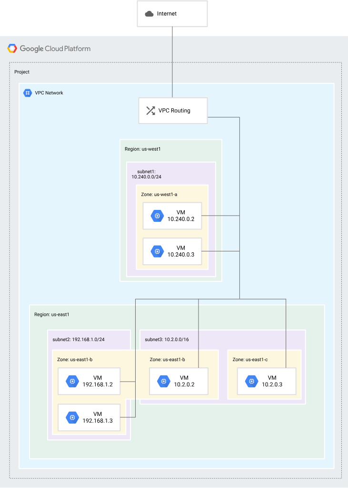
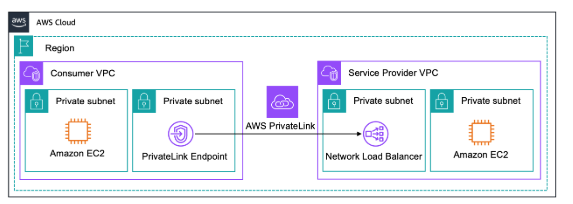

## 1. Cloud VPC(Virtual Private Cloud)

- 仮想的にVPCを実現
- Google Cloud内で互いに論理的に隔離されている

## 2. VPC ネットワーク

- GKEクラスタ、サーバーレス ワークロード、Compute Engine VM 上に構築された他の Google Cloud プロダクトなど、Compute Engine 仮想マシン（VM）インスタンスに向けた接続を提供
- 内部アプリケーション ロードバランサ用に組み込みの内部パススルーネットワークロードバランサとプロキシシステムを提供
- Cloud VPN トンネルと、Cloud Interconnect 用の VLAN アタッチメントを使用して、オンプレミス ネットワークに接続
- Google Cloud の外部ロードバランサからバックエンドにトラフィックを分散



### 2.1. ファイアウォール ルール

- 構成可能な分散仮想ファイアウォールが実装されている
- すべての VPC ネットワークには、すべての着信接続をブロックし、すべての発信接続を許可する 2 つの暗黙のファイアウォール ルールがある
- default ネットワークには、default-allow-internal ルールなどの、ネットワークでのインスタンス間の通信を許可する追加のファイアウォール ルールがある

### 2.2. ルート

各 VPC ネットワークにはいくつかのシステム生成ルートが用意されており、サブネット間でのトラフィックのルーティングや、適切なインスタンスからインターネットへのトラフィックの送信ができる

### 2.3. 転送ルール

転送ルールは、IP アドレス、プロトコル、ポートに基づいて VPC ネットワーク内の Google Cloud リソースにトラフィックを転送

## 3. インターフェースと IP アドレス

VPC ネットワークは、IP アドレスと VM ネットワーク インターフェース用の次の構成を提供

### 3.1. IP アドレス

Compute Engine VM インスタンス、転送ルール、GKE コンテナなどのGoogle Cloud リソースは、IP アドレスを利用して通信する

### 3.2. エイリアス IP 範囲

単一の VM インスタンス上で実行しているサービスが複数ある場合は、エイリアス IP 範囲を使用して各サービスに異なる内部 IP アドレスを割り当てることができる

### 3.3. 複数のネットワーク インターフェース

1 つの VM インスタンスに複数のネットワークインターフェースを追加できる

## 4. VPC の共有とピアリング

### 4.1. 共有 VPC

1 つのプロジェクトから Google Cloud 組織内の他のプロジェクトに VPC ネットワークを共有できる

### 4.2. VPC ネットワーク ピアリング

- 異なる VPC ネットワーク間でサービスを非公開で利用できるようになる
- VPC ネットワーク ピアリングでは、内部 IP アドレスを使用してすべての通信が行われる

#### 4.2.1. デメリット

- **IP アドレスの重複:** 両方の VPC で同じ IP 範囲を使っていると接続できない。
- **管理の複雑さ:** 接続先が増えるたびに網目のような設定が必要。
- **セキュリティ:** ネットワーク全体が繋がってしまうため、特定のサービスだけを見せることが難しい。

## 5. ハイブリッド クラウド

### 5.1. Cloud VPN

Cloud VPN を使用すると、安全なバーチャル プライベート ネットワークを使用して、VPC ネットワークを物理的なオンプレミス ネットワークまたは別のクラウド プロバイダに接続できる

### 5.2. Cloud Interconnect

高速な物理接続を使って、VPC ネットワークをオンプレミス ネットワークに接続できる

## 6. Cloud Load Balancing

多くのバックエンド タイプにトラフィックとワークロードを分散するロード バランシング構成がいくつか用意されている

## 7. 外部接続

- インターネットゲートウェイ（igw）
  - VPCにigwをアタッチする
- 仮想プライベートゲートウェイ (VGW)
  - VPCが外部環境と接続する際のゲートウェイ
- VPC peering
  - 別のVPC同士をつなぐ
- Transit gateway
- VPCエンドポイント
  - インターネットを経由せずGCPのサービスに接続するためのエンドポイント
- Private Link
  - 
  - Customer VPC　→　Service Provider VPCに対し「一方通行」の接続が可能となる

## 8. 同一VPCで内部のみで通信させる

- private-ranges-only を設定しただけだと、*.a.run.app 宛の通信はVPCを通らず、依然としてインターネット（外部）経由で飛んでいってしまう

- 呼び出し元Cloud Run
  - all-trafic

```yaml
annotations:
  run.googleapis.com/vpc-access-connector: "projects/PROJECT_ID/locations/REGION/connectors/CONNECTOR_NAME"
  run.googleapis.com/vpc-access-egress: "all-traffic"
```

- 呼び出し先Cloud Run

### 8.1. Direct VPC egress

- 中継サーバーを置かず、Cloud Run から VPC へ**直接（Direct）**ネットワークを繋ぐ方式
- Cloud Run インスタンスに、VPC のサブネットの IP アドレスを直接割り当て

### 8.2. Private Service Connect

- 別々のネットワーク（VPC）にあるサービス同士を、あたかも自分のネットワーク内のプライベートIP（エンドポイント）であるかのように繋ぐ仕組み
- これまでは「VPC ネットワーク ピアリング」という方法が主流だった

#### 8.2.1. PSC の主な仕組み（エンドポイント方式）

1. **プロデューサー（提供者）:** サービス（例：DBやAPI）を公開する側。
2. **コンシューマー（利用者）:** あなたの VPC。
3. **エンドポイント:** あなたの VPC 内に「`10.0.0.5`」などのプライベート IP を作成。この IP に通信を送ると、**Google のバックボーンネットワークを経由して、相手のサービスに直接届く。**

## 9. 参考

- [Virtual Private Cloud（VPC）の概要](https://docs.cloud.google.com/vpc/docs/overview?hl=ja)
- [いまさら聞けないVPCのお話し　その①](https://www.ctc-g.co.jp/solutions/cloud/column/article/145.html)
