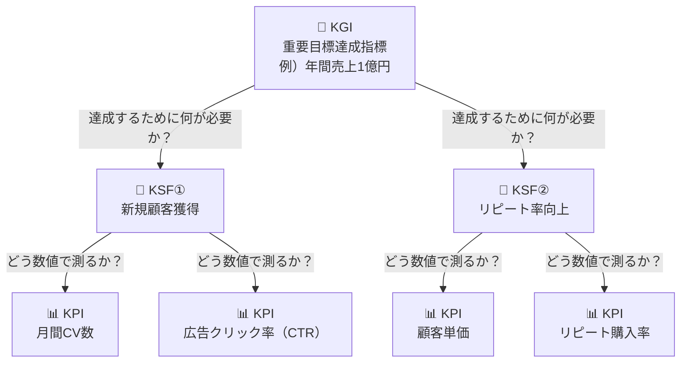

# Webマーケティング

## 1. 概要

Webマーケティングとは、Webサイト、SNS、検索エンジン、メールなど、インターネット上の技術を活用して、商品・サービスの認知拡大から購買、ファン化を促進する活動。

## 2. 手法

- Webサイト・オウンドメディア運用：自社サイトを制作・運営し、情報発信や問い合わせ・購入の拠点とする。
- SEO対策（検索エンジン最適化）：Googleなどの検索結果で上位に表示させ、自然検索からの流入を増やす。
- Web広告：リスティング広告、SNS広告、動画広告などを利用し、ターゲットへ直接アプローチする。
- SNSマーケティング：X（Twitter）、Instagram、Facebookなどを活用し、ユーザーと交流・拡散する。
- コンテンツマーケティング：ブログ記事やホワイトペーパーなどで有益な情報を提供し、ファンや見込み顧客を獲得する。
- メールマーケティング：メルマガやステップメールでユーザーの行動に合わせた情報を配信する。

- ホワイトペーパー:マーケティング施策の一つ

## 3. 指標

- KPI（Key Performance Indicator）：重要業績評価指標
- KGI（Key Goal Indicator）:重要目標達成指標
- KSF（Key Success Factor）：重要成功要因

### 3.1. KPI設定のプロセス

### 3.2. Webマーケティングでよく使われるKPI項目

- PV（ページビュー）
  - どれくらいページが閲覧されたかというPV（Page View）数は、サイトの規模や集客の状況を判断する最も基本的な指標
- UU（ユニークユーザー）
  - UU（Unique User）は、一定の期間にWebサイトを訪れたユーザーの数を表す、よく使われている指標。1人のユーザー（1つの端末）が設定された期間内に何回Webサイトを訪れても、UUは1と数えられる。
- セッション数（訪問数）
  - セッションとは、Webサイトにアクセスしたユーザーが、サイト内を閲覧し、離脱するまでの行動を指す。セッション数はその数をカウントしたもので、直帰率やCVRの計算に使われる。
- 回遊率、直帰率
  - 回遊率とは、Webサイト内で1ユーザーが1回の訪問でどれぐらいのページを見たかという指標。PV数を訪問者数で割った平均PV数
  - 1ページだけを見てそのサイトから離れてしまった割合を直帰率という。
- CVR（コンバージョン率）
  - セッション数のうち、コンバージョン（求める具体的な成果）をどのぐらい獲得できたかという割合を表す指標。

## 4. 通常トラッキングとイベントトラッキングの違いは？

通常トラッキング：ページ遷移などを記録
イベントトラッキング：クリックなどユーザーの行動を記録

## 5. 参考

[https://satori.marketing/marketing-blog/whitepaper/](https://satori.marketing/marketing-blog/whitepaper/)
