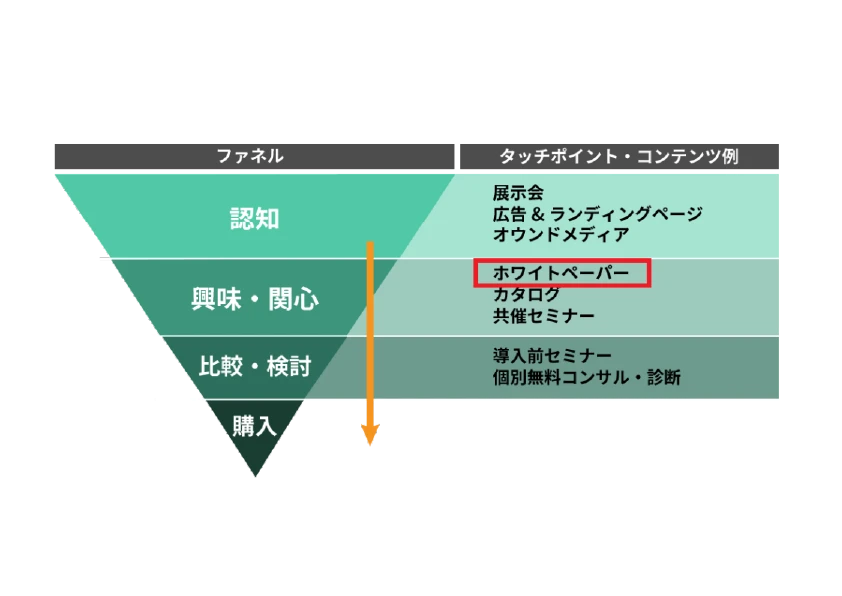

## 1. 施策

- ホワイトペーパー
　- マーケティング施策の一つ

## 2. 通常トラッキングとイベントトラッキングの違いは？

通常トラッキング：ページ遷移などを記録
イベントトラッキング：クリックなどユーザーの行動を記録

## 3. 参考

[https://satori.marketing/marketing-blog/whitepaper/](https://satori.marketing/marketing-blog/whitepaper/)
